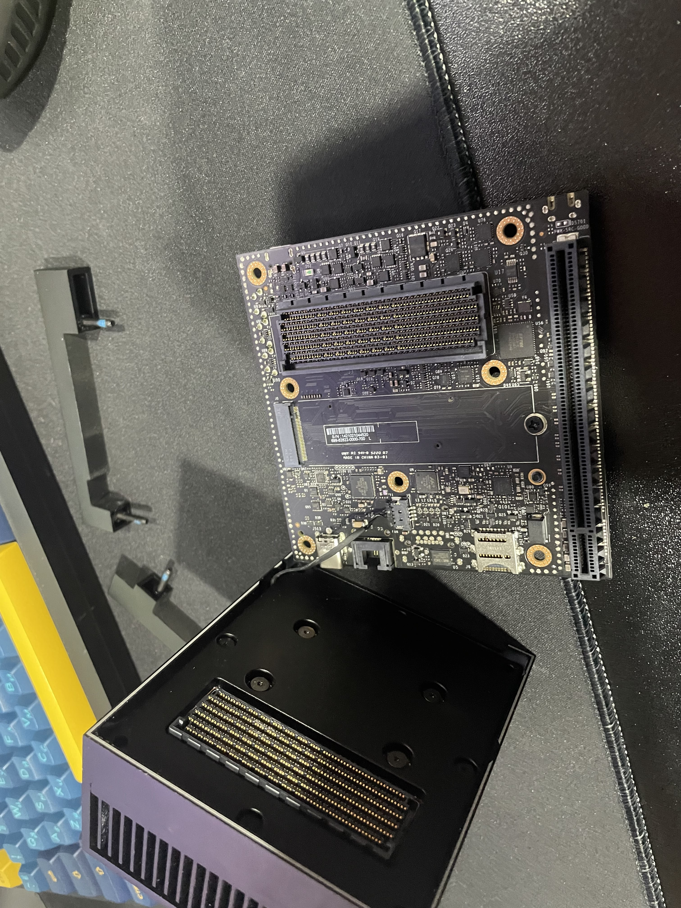
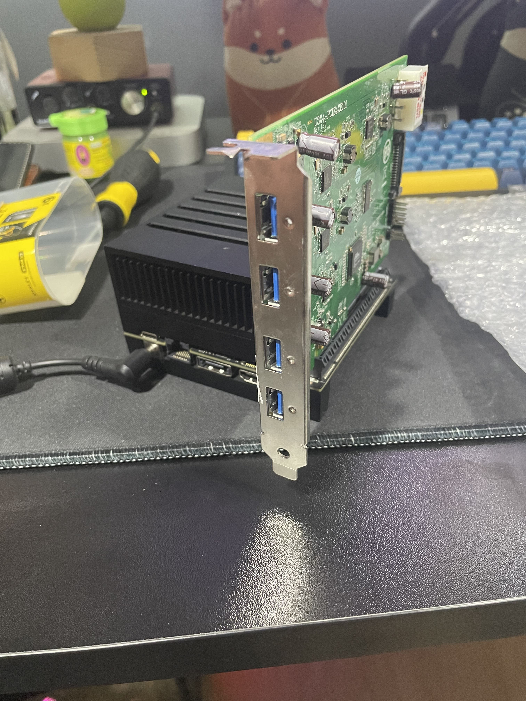

# Jetson AGX Xavier – Setup and Flashing Guide

## Implementation: Step-by-Step

### Equipment Required

1. Jetson AGX Xavier  
2. Laptop (Ubuntu 20.04 recommended)  
3. USB Type-C cable (for connection between Jetson and laptop)  

---

### 1. Upgrade SSD on Jetson AGX Xavier

Install the M.2 SSD and optional PCIe to USB 3.0 interface (if required).  
Refer to the images below for the hardware installation.

| M.2 SSD | Installed SSD | PCIe to USB 3.0 Card |
|:--:|:--:|:--:|
||||

---

### 2. Flash Jetson AGX Xavier with the Latest OS (JetPack)

#### Flashing Steps:

1. **Prepare a Host Machine with Ubuntu OS**  
   - Recommended: Ubuntu 20.04

2. **Install NVIDIA SDK Manager on the Host Laptop**  
   - Download from: [https://developer.nvidia.com/sdk-manager](https://developer.nvidia.com/sdk-manager)

3. **Connect Jetson AGX Xavier to the Host via USB Type-C**  
   - Use a USB Type-C cable to connect the Jetson device to your laptop.

4. **Enter Recovery Mode on Jetson AGX Xavier**
   - Press and hold the **Force Recovery** button.  
   - While holding it, press and release the **Power** button.  
   - Then release the **Force Recovery** button.  
   - The host should now detect the Jetson device. Verify connection using:
     ```bash
     lsusb
     ```

5. **Launch SDK Manager to Flash Jetson**
   - Open SDK Manager on your laptop.  
   - Select the correct Jetson device and version (e.g., **JetPack 5.1.5** is the latest version for Jetson AGX Xavier).  
   - Follow the on-screen instructions to flash the firmware and OS.

6. **After flashing** 
   - complete the initial setup on Jetson (username, locale, etc.) via the display or SSH.
---
